# Class:7 Machine Learning 1
Steven Studdard (PID: A19123470)

- [Background](#background)
- [K-means clustering](#k-means-clustering)
- [Hierarchical Clustering](#hierarchical-clustering)
- [Principal Component Analysis
  (PCA)](#principal-component-analysis-pca)
  - [Analysis of UK food data](#analysis-of-uk-food-data)
- [Data Import](#data-import)
- [Tidy the data](#tidy-the-data)
- [Exporatory analysis](#exporatory-analysis)
- [PCA to the rescure](#pca-to-the-rescure)

## Background

Today we will explore some core machine learning methods that are very
popular in bioinformatics. These include **clustering** and
**dimensionally reduction**.

## K-means clustering

The main function in “base” R for K-means clustering is called \`kmeans

Before we get too deep let’s make up some “simple” data that we cam
cluster amd know if we are getting a good answer or not. To do this we
an use the `rnorm()` function:

``` r
hist(rnorm(10000, mean = 3, sd = 2))
```

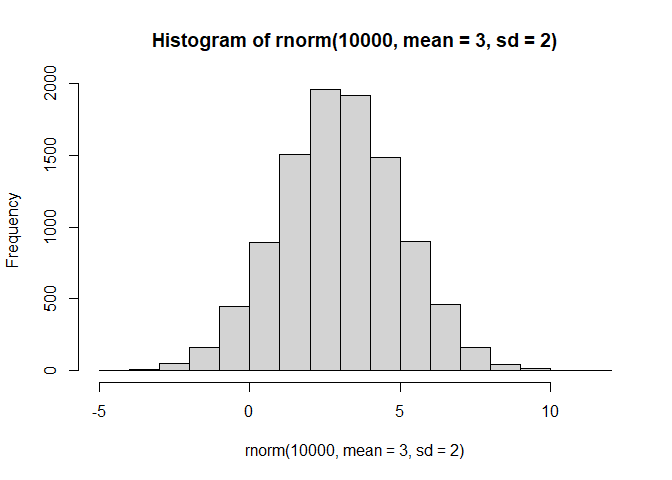

``` r
#rnorm makes a random distribution 
#cbind takes sequence combines by columns
#rev reverses the argument
x <- c(rnorm(30,-3), rnorm(30,3))
z <- cbind(x=x,y=rev(x))
plot(z)
```

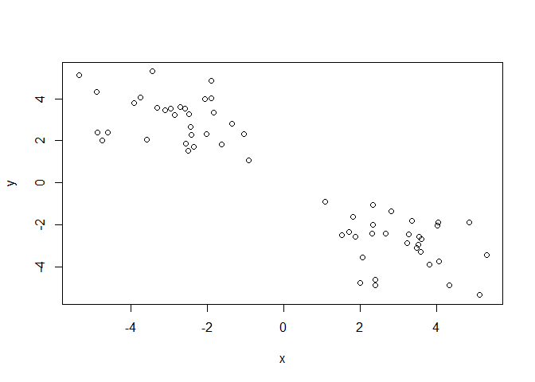

Now we can run `kmeans()` on tihs input `z` and see what the results
look like.

``` r
km <- kmeans(z, centers = 2)
km
```

    K-means clustering with 2 clusters of sizes 30, 30

    Cluster means:
              x         y
    1  3.081965 -2.867815
    2 -2.867815  3.081965

    Clustering vector:
     [1] 2 2 2 2 2 2 2 2 2 2 2 2 2 2 2 2 2 2 2 2 2 2 2 2 2 2 2 2 2 2 1 1 1 1 1 1 1 1
    [39] 1 1 1 1 1 1 1 1 1 1 1 1 1 1 1 1 1 1 1 1 1 1

    Within cluster sum of squares by cluster:
    [1] 75.21867 75.21867
     (between_SS / total_SS =  87.6 %)

    Available components:

    [1] "cluster"      "centers"      "totss"        "withinss"     "tot.withinss"
    [6] "betweenss"    "size"         "iter"         "ifault"      

``` r
attributes(km)
```

    $names
    [1] "cluster"      "centers"      "totss"        "withinss"     "tot.withinss"
    [6] "betweenss"    "size"         "iter"         "ifault"      

    $class
    [1] "kmeans"

> Q How many points are in each cluster?

``` r
km$size
```

    [1] 30 30

> Q. What “componennt” of you result object details cluster
> assignemnet/membership?

``` r
km$cluster
```

     [1] 2 2 2 2 2 2 2 2 2 2 2 2 2 2 2 2 2 2 2 2 2 2 2 2 2 2 2 2 2 2 1 1 1 1 1 1 1 1
    [39] 1 1 1 1 1 1 1 1 1 1 1 1 1 1 1 1 1 1 1 1 1 1

> Q. What “components of your result object details cluster center.

``` r
km$centers
```

              x         y
    1  3.081965 -2.867815
    2 -2.867815  3.081965

> Q. Plot `z` colored by the kmeanns cluster assignemnt and add cluster
> centers as blue points

``` r
library(ggplot2)

plot(z, col=km$cluster)
points(km$centers, col="blue", pch=15)
```

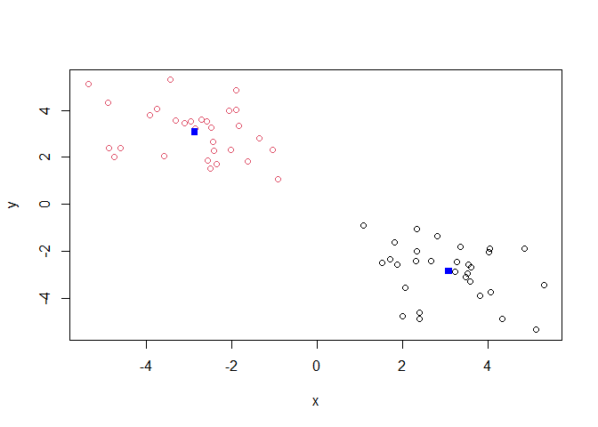

``` r
#Annotate lets you do a simple correction to a geom
ggplot(z, aes(x, y, color =km$cluster))+
  geom_point()+
  annotate("point", km$centers[1,], km$centers[,-1], color = "red")+
  annotate("point", km$centers[-1,], km$centers[,1], color = "red")
```

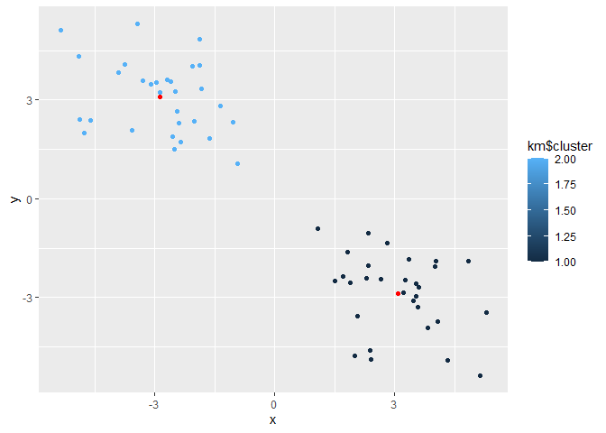

> Q. Run a K-means clustering and plot the results asking for 4
> clusters?

``` r
k4m <- kmeans(z, centers=4)
k4m
```

    K-means clustering with 4 clusters of sizes 18, 12, 21, 9

    Cluster means:
              x         y
    1 -3.411943  3.698489
    2 -2.051624  2.157180
    3  2.829815 -2.244592
    4  3.670317 -4.322003

    Clustering vector:
     [1] 2 2 2 1 1 1 2 2 1 2 1 1 1 1 2 2 1 1 2 1 1 2 1 2 1 1 1 1 1 2 3 3 4 4 4 4 3 4
    [39] 3 3 3 3 3 3 3 3 4 4 4 3 3 4 3 3 3 3 3 3 3 3

    Within cluster sum of squares by cluster:
    [1] 34.44633 10.34442 27.81670 15.76286
     (between_SS / total_SS =  92.7 %)

    Available components:

    [1] "cluster"      "centers"      "totss"        "withinss"     "tot.withinss"
    [6] "betweenss"    "size"         "iter"         "ifault"      

``` r
plot(z, col=k4m$cluster, pch=16)
points(k4m$centers, col="blue", pch=15)
```

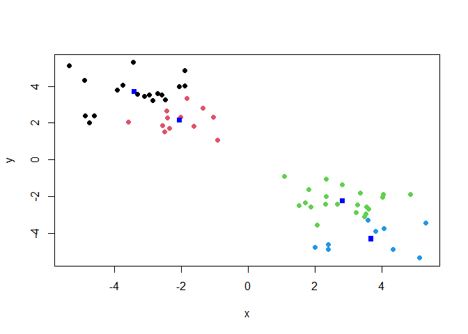

> **N.B.** You need to tell K-means the number of clusters (i.e. set
> `centers=2`)!!

One approach is to try different values for centers and then pick the
best.

``` r
ans <- NULL
for(i in 1:10){
 km <- kmeans(z, centers=i)
 ans <- c(ans, km$tot.withinss)
}

plot(ans, type="o",
     xlab="Number of clusters",
     ylab="total Sum of Squares Distance")
```

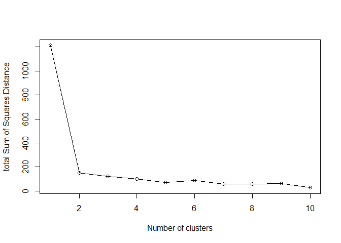

## Hierarchical Clustering

The main function in “base” R for Hierarchical Clustering is called
`hclust()`

The function does not take your “raw” data for clustering. You must
first build a “distnace matrix” from your data and pass this as input to
`hclust()`.

``` r
d <- dist(z)
hc <- hclust(d)
hc
```


    Call:
    hclust(d = d)

    Cluster method   : complete 
    Distance         : euclidean 
    Number of objects: 60 

There is a bespoke `plot()` method for `hclust()` result objects.

``` r
plot(hc)
abline(h=8, col="red")
```

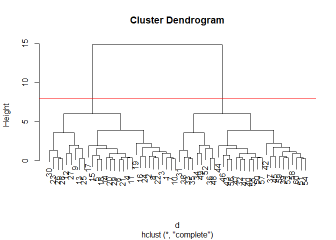

Once we have our `hclust()` object (our “tree” of “cluster dendrogram”)
we can **cut** the tree to reveal the clustering pattern.

``` r
cutree(hc, h=8)
```

     [1] 1 1 1 1 1 1 1 1 1 1 1 1 1 1 1 1 1 1 1 1 1 1 1 1 1 1 1 1 1 1 2 2 2 2 2 2 2 2
    [39] 2 2 2 2 2 2 2 2 2 2 2 2 2 2 2 2 2 2 2 2 2 2

``` r
cutree(hc, k=4)
```

     [1] 1 1 1 1 1 1 1 1 2 1 1 2 2 1 1 1 1 1 1 1 1 1 2 1 2 2 2 2 1 2 3 4 3 3 3 3 4 3
    [39] 4 4 4 4 4 4 4 4 4 3 3 4 4 3 4 4 4 4 4 4 4 4

> Q. Make a plot of `z` with your hclust results (i.e. color by cluster
> membership)

``` r
grps <- cutree(hc, k=2)
plot(z, col= grps)
```

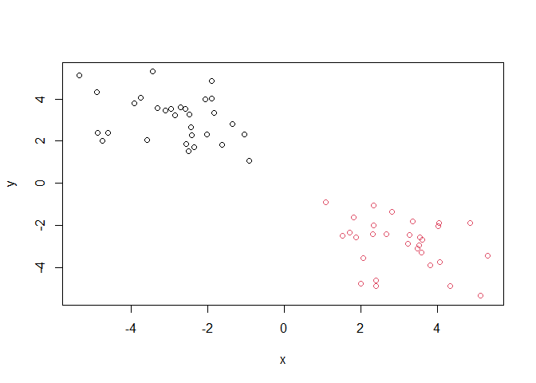

## Principal Component Analysis (PCA)

PCA is a dimensionality reduction method that is popular for revealing
patterns in complex datasets.

### Analysis of UK food data

Let’s look at some data on the eating habits of folks from the UK to see
if there are patterns and trends that have some regions being distinct
from others.

## Data Import

The data is made available in CSV format

``` r
url <- "https://tinyurl.com/UK-foods"
x <- read.csv(url)
```

> Q1. How many rows and columns are in your new data frame named x? What
> R functions could you use to answer this questions?

There are 17 rows and 5 columns we can find this out with nrow/ncol or
just use dim().

``` r
dim(x)
```

    [1] 17  5

## Tidy the data

Fix anything that went wrong with the data import.

``` r
rownames(x) <- x[,1]
x <- x[,-1]
head(x)
```

                   England Wales Scotland N.Ireland
    Cheese             105   103      103        66
    Carcass_meat       245   227      242       267
    Other_meat         685   803      750       586
    Fish               147   160      122        93
    Fats_and_oils      193   235      184       209
    Sugars             156   175      147       139

``` r
dim(x)
```

    [1] 17  4

> Q2. Which approach to solving the ‘row-names problem’ mentioned above
> do you prefer and why? Is one approach more robust than another under
> certain circumstances?

I think that I prefer the method of just fixing the dataset as I import
it in. When you re-run the code of subtracting one of the colunms to
instead make it a row name, it slowly just removes more and more
columns. You do not run into that issue if you just
`x <- read.csv(url, row.names=1)` at the beginning.

## Exporatory analysis

Make some plots to help make sense of obvious trends..

``` r
barplot(as.matrix(x), beside=FALSE, col=rainbow(nrow(x)))
```

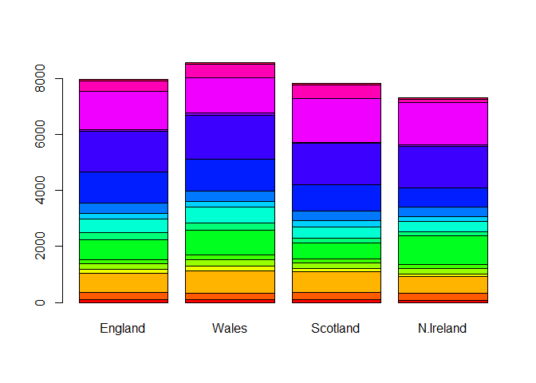

> Q3: Changing what optional argument in the above barplot() function
> results in the following plot?

Within the “base” R barplot function there is a argument that is called
“beside” if beside is true then the columns of the data are shwon as
seperate bars, but when it is false it is just stacked upon each other.

``` r
library(tidyr)
library(ggplot2)
# Convert data to long format for ggplot with `pivot_longer()`
x_long <- x |> 
          tibble::rownames_to_column("Food") |> 
          pivot_longer(cols = -Food, 
                       names_to = "Country", 
                       values_to = "Consumption")

dim(x_long)
```

    [1] 68  3

``` r
head(x_long)
```

    # A tibble: 6 × 3
      Food            Country   Consumption
      <chr>           <chr>           <int>
    1 "Cheese"        England           105
    2 "Cheese"        Wales             103
    3 "Cheese"        Scotland          103
    4 "Cheese"        N.Ireland          66
    5 "Carcass_meat " England           245
    6 "Carcass_meat " Wales             227

``` r
ggplot(x_long) +
  aes(x = Country, y = Consumption, fill = Food) +
  geom_col(position = "stack") +
  theme_bw()
```

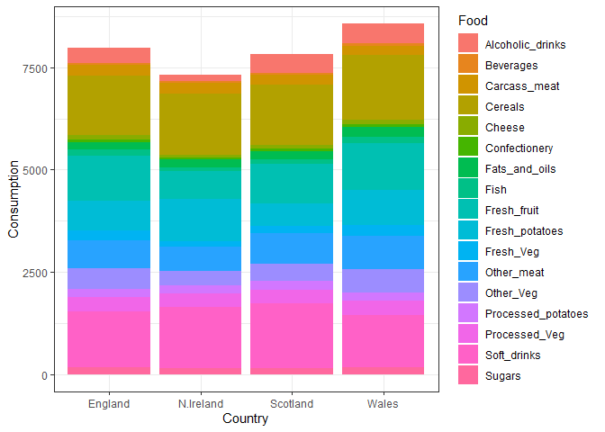

> Q4. Changing what optional argument in the above ggplot() code results
> in a stacked barplot figure?

You change the position argument in the `geom_col()`function. The
position argument just changes how you want the bar plot to display your
data.

``` r
pairs(x, col=rainbow(nrow(x)), pch=16)
```


> Q5: We can use the pairs() function to generate ll pairwise plots for
> our countries. Can you make sense of the following code and resulting
> figure? What does it mean if a given point lies on the diagonal for a
> given plot?

The `pairs()` function is creating a bunch of scatterplots with each dot
being a different food category. Comparing each of our countries to one
other country (for example the second plot is England compared with
Wales). Being on the diagonal means that the two are very similar nearly
1:1 in what they eat.

``` r
library(pheatmap)

pheatmap( as.matrix(x) )
```

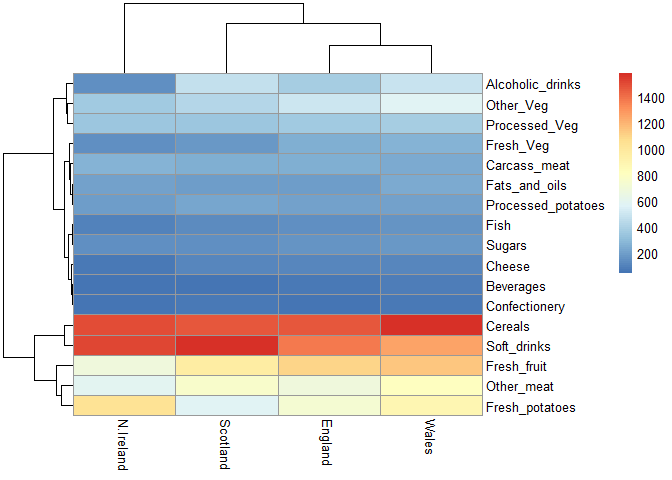

> Q6. Based on the pairs and heatmap figures, which countries cluster
> together and what does this suggest about their food consumption
> patterns? Can you easily tell what the main differences between N.
> Ireland and the other countries of the UK in terms of this data-set?

You can start to be able to tell the differences between the heatmap and
the pairplots. N. Ireland seems to be seperate from the other three,
most of the dots are off-center in the `pairs()` and in the tree its the
longest branch. Its hard to be able to tell the main differences
however, you have to look at it a bit.

> **Key-point**: Even relatively small datasets can prove challenging to
> interpret.

## PCA to the rescure

The main function in “base” R for PCA is caleld `prcomp()`. This
function wants the “observations” to be rows and the “variables” to be
columns.

So here we need to take the transpose of our `x` input object.

``` r
#T is transpose and it flips rows and col
pca <- prcomp(t(x))
summary(pca)
```

    Importance of components:
                                PC1      PC2      PC3       PC4
    Standard deviation     324.1502 212.7478 73.87622 3.176e-14
    Proportion of Variance   0.6744   0.2905  0.03503 0.000e+00
    Cumulative Proportion    0.6744   0.9650  1.00000 1.000e+00

The returned `pca` object has components that we can use to make our
main result figures.

``` r
attributes(pca)
```

    $names
    [1] "sdev"     "rotation" "center"   "scale"    "x"       

    $class
    [1] "prcomp"

The main result figure from this analysis is called a **“PC sore plot”**
or “Ordination plot”or “PC Plot” or “PC1 vs PC2 plot”.

This plot shows how samples (in this case countries) relate to each
other along our new PC axis.

This is our new “reduced-dimensional space”. In this case 2 dimensions,
PC1 and PC2, that capture most of the variance in the original 17
dimension data-set.

> Q7. Complete the code below to generate a plot of PC1 vs PC2. The
> second line adds text labels over the data points.

``` r
ggplot(pca$x)+
     aes(PC1, PC2)+
     geom_point()
```

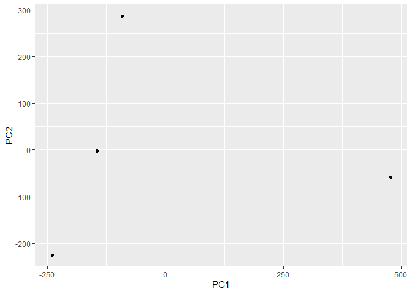

> Q8. Customize your plot so that the colors of the country names match
> the colors in our UK and Ireland map and table at start of this
> document.

``` r
mycols <- c("orange", "red", "blue", "darkgreen")

ggplot(pca$x)+
     aes(PC1, PC2)+
     geom_point(col=mycols)
```


``` r
ggplot(pca$x)+
     aes(PC1, PC2, label = row.names(pca$x))+
     geom_point(col=mycols)+
     geom_text(size = 3, vjust=2, col=mycols)
```

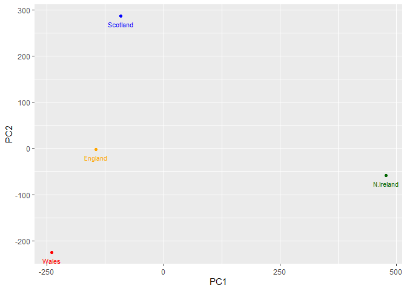

``` r
ggplot(pca$rotation)+
  aes(PC1, reorder(row.names(pca$rotation), PC1))+
  geom_col()
```

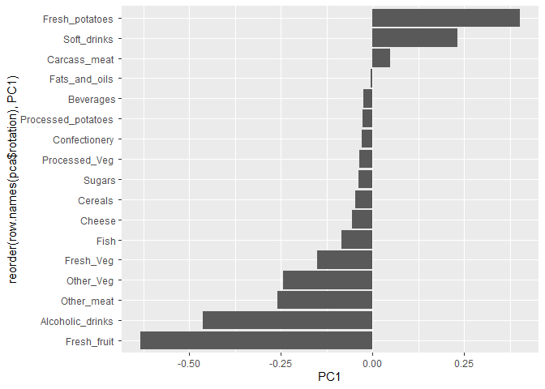

> Q9: Generate a similar ‘loadings plot’ for PC2. What two food groups
> feature prominantely and what does PC2 maninly tell us about?

``` r
ggplot(pca$rotation)+
  aes(x=PC2, y= reorder(row.names(pca$rotation), PC2))+
  geom_col()
```

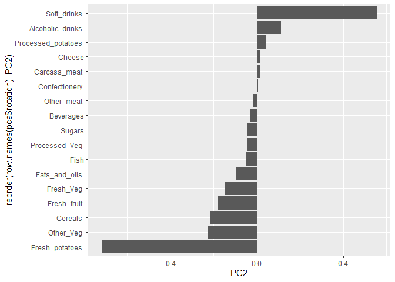

A PC score plot is a plot used to identify groupings in data. Creating
“principal components” and mapping these sores out to see the variance
in patterns.

A loading plot is a plot to display the relationship between the
original variables and hte principle components.

A scree plot is used to analyze variance from the PC components of PCA.
