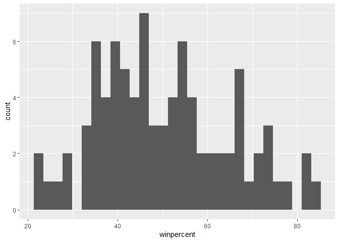
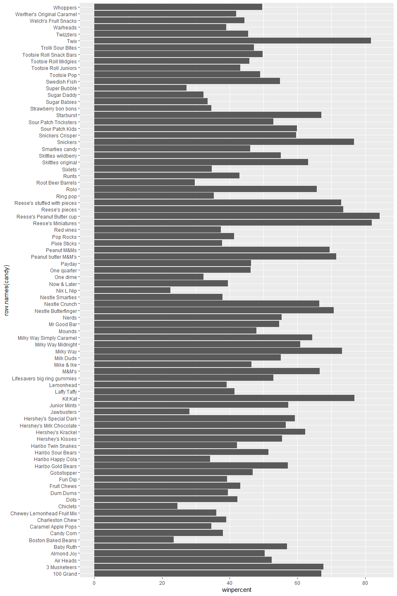
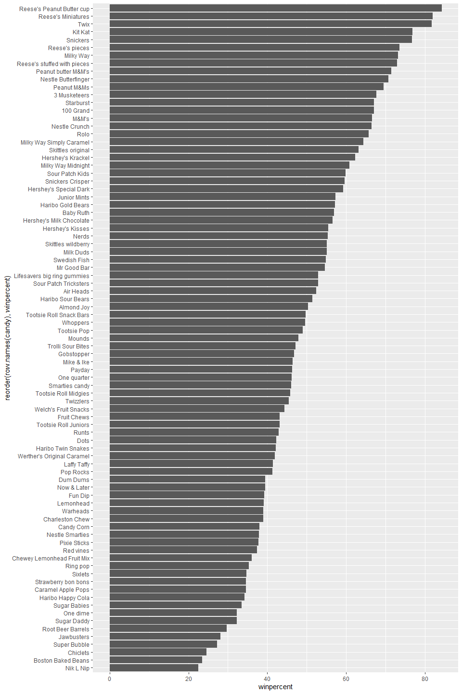
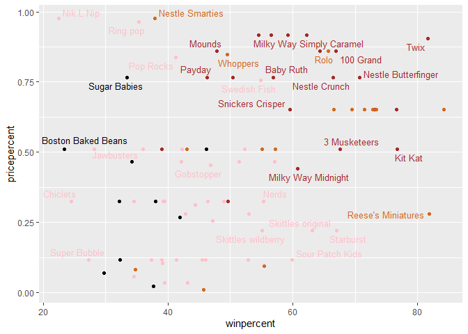
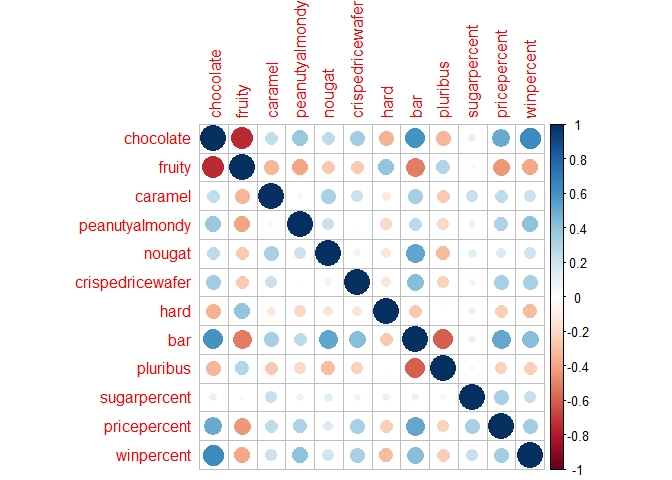
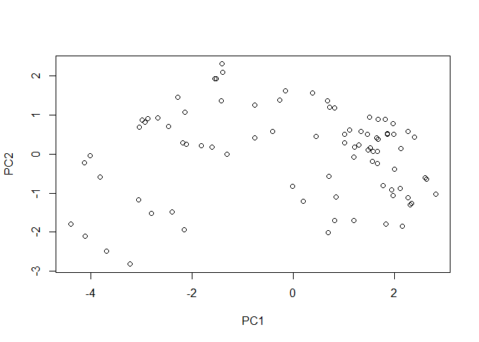
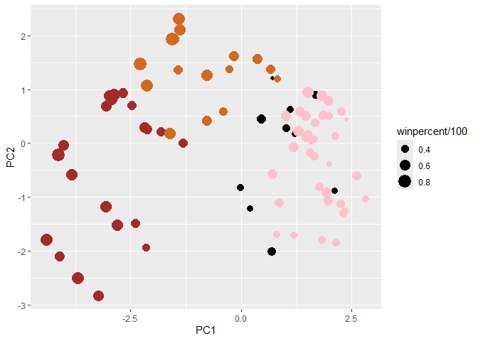
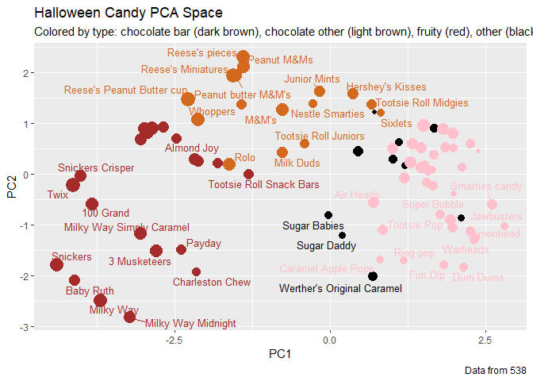

# Class 09: Candy Mini Project
Steven Studdard (PID: A19123470)

- [Importing the Candy Data](#importing-the-candy-data)
- [What is in the dataset?](#what-is-in-the-dataset)
- [What is your favorite candy?](#what-is-your-favorite-candy)
- [Exploratory Analysis](#exploratory-analysis)
- [Overall Candy Rankings](#overall-candy-rankings)
- [Taking a look at pricepercent](#taking-a-look-at-pricepercent)
- [Exploring the correlation
  structure](#exploring-the-correlation-structure)
- [Principal Component Analysis](#principal-component-analysis)
- [Summary](#summary)

## Importing the Candy Data

``` r
#Load the dataset
candy <- read.csv("candy-data.txt", row.names = 1)

head(candy)
```

                 chocolate fruity caramel peanutyalmondy nougat crispedricewafer
    100 Grand            1      0       1              0      0                1
    3 Musketeers         1      0       0              0      1                0
    One dime             0      0       0              0      0                0
    One quarter          0      0       0              0      0                0
    Air Heads            0      1       0              0      0                0
    Almond Joy           1      0       0              1      0                0
                 hard bar pluribus sugarpercent pricepercent winpercent
    100 Grand       0   1        0        0.732        0.860   66.97173
    3 Musketeers    0   1        0        0.604        0.511   67.60294
    One dime        0   0        0        0.011        0.116   32.26109
    One quarter     0   0        0        0.011        0.511   46.11650
    Air Heads       0   0        0        0.906        0.511   52.34146
    Almond Joy      0   1        0        0.465        0.767   50.34755

## What is in the dataset?

``` r
#Nrow to see rows, sum to sum up the T/F
nrow(candy)
```

    [1] 85

``` r
sum(candy$fruity)
```

    [1] 38

> Q1. How many different candy types are in this dataset?

There are 85 different candy types in this dataset.

> Q2. How many fruity candy types are in the dataset?

There are 38 different fruity candy types in the dataset.

## What is your favorite candy?

``` r
#Load the dplyr library
library(dplyr)
```


    Attaching package: 'dplyr'

    The following objects are masked from 'package:stats':

        filter, lag

    The following objects are masked from 'package:base':

        intersect, setdiff, setequal, union

``` r
#We filter it to a singular row with the filter, and then select a specific area with select. We combine it with the pipes. 

candy|> 
  filter(row.names(candy)=="Twix") |> 
  select(winpercent)
```

         winpercent
    Twix   81.64291

``` r
candy|> 
  filter(row.names(candy)=="Snickers") |> 
  select(winpercent)
```

             winpercent
    Snickers   76.67378

``` r
candy|> 
  filter(row.names(candy)=="Kit Kat") |> 
  select(winpercent)
```

            winpercent
    Kit Kat    76.7686

``` r
candy|> 
  filter(row.names(candy)=="Tootsie Roll Snack Bars") |> 
  select(winpercent)
```

                            winpercent
    Tootsie Roll Snack Bars    49.6535

> Q3. What is your favorite candy (other than Twix) in the dataset and
> what is it’s winpercent value?

My favorite candy is Snickers and it’s winpercent value is 76.67378.

> Q4. What is the winpercent value for “Kit Kat”?

The winpercent value for Kit Kat is 76.7686.

> Q5. What is the winpercent value for “Tootsie Roll Snack Bars”?

The winpercent value for Tootsie Roll Snack Bars is 49.6535.

``` r
library("skimr")
skim(candy)
```

|                                                  |       |
|:-------------------------------------------------|:------|
| Name                                             | candy |
| Number of rows                                   | 85    |
| Number of columns                                | 12    |
| \_\_\_\_\_\_\_\_\_\_\_\_\_\_\_\_\_\_\_\_\_\_\_   |       |
| Column type frequency:                           |       |
| numeric                                          | 12    |
| \_\_\_\_\_\_\_\_\_\_\_\_\_\_\_\_\_\_\_\_\_\_\_\_ |       |
| Group variables                                  | None  |

Data summary

**Variable type: numeric**

| skim_variable | n_missing | complete_rate | mean | sd | p0 | p25 | p50 | p75 | p100 | hist |
|:---|---:|---:|---:|---:|---:|---:|---:|---:|---:|:---|
| chocolate | 0 | 1 | 0.44 | 0.50 | 0.00 | 0.00 | 0.00 | 1.00 | 1.00 | ▇▁▁▁▆ |
| fruity | 0 | 1 | 0.45 | 0.50 | 0.00 | 0.00 | 0.00 | 1.00 | 1.00 | ▇▁▁▁▆ |
| caramel | 0 | 1 | 0.16 | 0.37 | 0.00 | 0.00 | 0.00 | 0.00 | 1.00 | ▇▁▁▁▂ |
| peanutyalmondy | 0 | 1 | 0.16 | 0.37 | 0.00 | 0.00 | 0.00 | 0.00 | 1.00 | ▇▁▁▁▂ |
| nougat | 0 | 1 | 0.08 | 0.28 | 0.00 | 0.00 | 0.00 | 0.00 | 1.00 | ▇▁▁▁▁ |
| crispedricewafer | 0 | 1 | 0.08 | 0.28 | 0.00 | 0.00 | 0.00 | 0.00 | 1.00 | ▇▁▁▁▁ |
| hard | 0 | 1 | 0.18 | 0.38 | 0.00 | 0.00 | 0.00 | 0.00 | 1.00 | ▇▁▁▁▂ |
| bar | 0 | 1 | 0.25 | 0.43 | 0.00 | 0.00 | 0.00 | 0.00 | 1.00 | ▇▁▁▁▂ |
| pluribus | 0 | 1 | 0.52 | 0.50 | 0.00 | 0.00 | 1.00 | 1.00 | 1.00 | ▇▁▁▁▇ |
| sugarpercent | 0 | 1 | 0.48 | 0.28 | 0.01 | 0.22 | 0.47 | 0.73 | 0.99 | ▇▇▇▇▆ |
| pricepercent | 0 | 1 | 0.47 | 0.29 | 0.01 | 0.26 | 0.47 | 0.65 | 0.98 | ▇▇▇▇▆ |
| winpercent | 0 | 1 | 50.32 | 14.71 | 22.45 | 39.14 | 47.83 | 59.86 | 84.18 | ▃▇▆▅▂ |

> Q6. Is there any variable/column that looks to be on a different scale
> to the majority of the other columns in the dataset?

Winpercent is the only one that isn’t on a 0-1 one scale.

> Q7. What do you think a zero and one represent for the
> candy\$chocolate column?

One means that it is true that the candy does contain chocolate, a zero
means it does not.

## Exploratory Analysis

``` r
#Load ggplot
library(ggplot2)
```

> Q8. Plot a histogram of winpercent values using both base R and
> ggplot2.

``` r
#Default R histogram
hist(candy$winpercent)
```


``` r
#ggplot histogram
ggplot(candy)+
  aes(winpercent)+
  geom_histogram()
```

    `stat_bin()` using `bins = 30`. Pick better value `binwidth`.



> Q9. Is the distribution of winpercent values symmetrical?

No, the distribution of winpercent values are not symmetrical.

> Q10. Is the center of the distribution above or below 50%?

It is below 50%.

> Q11. On average is chocolate candy higher or lower ranked than fruit
> candy?

On average chocolate is higher ranked than fruit candy.

``` r
fruitywin <- mean(candy$winpercent[as.logical(candy$fruity)])
chocowin <- mean(candy$winpercent[as.logical(candy$chocolate)])

fruitywin > chocowin
```

    [1] FALSE

> Q12. Is this difference statistically significant?

Yes, this difference is statistically significant.

``` r
t.test(candy$winpercent[as.logical(candy$chocolate)], candy$winpercent[as.logical(candy$fruity)])
```


        Welch Two Sample t-test

    data:  candy$winpercent[as.logical(candy$chocolate)] and candy$winpercent[as.logical(candy$fruity)]
    t = 6.2582, df = 68.882, p-value = 2.871e-08
    alternative hypothesis: true difference in means is not equal to 0
    95 percent confidence interval:
     11.44563 22.15795
    sample estimates:
    mean of x mean of y 
     60.92153  44.11974 

## Overall Candy Rankings

``` r
head(candy[order(candy$winpercent, decreasing = TRUE),], n=5)
```

                              chocolate fruity caramel peanutyalmondy nougat
    Reese's Peanut Butter cup         1      0       0              1      0
    Reese's Miniatures                1      0       0              1      0
    Twix                              1      0       1              0      0
    Kit Kat                           1      0       0              0      0
    Snickers                          1      0       1              1      1
                              crispedricewafer hard bar pluribus sugarpercent
    Reese's Peanut Butter cup                0    0   0        0        0.720
    Reese's Miniatures                       0    0   0        0        0.034
    Twix                                     1    0   1        0        0.546
    Kit Kat                                  1    0   1        0        0.313
    Snickers                                 0    0   1        0        0.546
                              pricepercent winpercent
    Reese's Peanut Butter cup        0.651   84.18029
    Reese's Miniatures               0.279   81.86626
    Twix                             0.906   81.64291
    Kit Kat                          0.511   76.76860
    Snickers                         0.651   76.67378

``` r
head(candy[order(candy$winpercent),], n=5)
```

                       chocolate fruity caramel peanutyalmondy nougat
    Nik L Nip                  0      1       0              0      0
    Boston Baked Beans         0      0       0              1      0
    Chiclets                   0      1       0              0      0
    Super Bubble               0      1       0              0      0
    Jawbusters                 0      1       0              0      0
                       crispedricewafer hard bar pluribus sugarpercent pricepercent
    Nik L Nip                         0    0   0        1        0.197        0.976
    Boston Baked Beans                0    0   0        1        0.313        0.511
    Chiclets                          0    0   0        1        0.046        0.325
    Super Bubble                      0    0   0        0        0.162        0.116
    Jawbusters                        0    1   0        1        0.093        0.511
                       winpercent
    Nik L Nip            22.44534
    Boston Baked Beans   23.41782
    Chiclets             24.52499
    Super Bubble         27.30386
    Jawbusters           28.12744

> Q13. What are the five least liked candy types in this set?

The 5 least liked candy types in this data set are Nik L Nip, Boston
Baked Beans, Chiclets, Super Bubble, and Jawbusters.

> Q14. What are the top 5 all time favorite candy types out of this set?

The top 5 all time candy types are Reese’s Peanut Butter Cups, Reese’s
Miniatures, Twix, Kit Kat and Snickers.

> Q15. Make a first barplot of candy ranking based on winpercent values.

``` r
ggplot(candy)+
  aes(winpercent, row.names(candy))+
  geom_col()
```



> Q16. This is quite ugly, use the reorder() function to get the bars
> sorted by winpercent?

``` r
ggplot(candy)+
  aes(winpercent, reorder(row.names(candy), winpercent))+
  geom_col()
```



``` r
my_cols=rep("black", nrow(candy))
my_cols[as.logical(candy$chocolate)] = "chocolate"
my_cols[as.logical(candy$bar)] = "brown"
my_cols[as.logical(candy$fruity)] = "pink"
```

``` r
ggplot(candy) + 
  aes(winpercent, reorder(rownames(candy),winpercent)) +
  geom_col(fill=my_cols) +
  ylab("")
```


> Q17. What is the worst ranked chocolate candy?

Sixlets is the worst ranked chocolate candy.

> Q18. What is the best ranked fruity candy?

Starburst is the best ranked fruity candy.

## Taking a look at pricepercent

``` r
library(ggrepel)
```

``` r
ggplot(candy) +
  aes(winpercent, pricepercent, label=rownames(candy)) +
  geom_point(col=my_cols) + 
  geom_text_repel(col=my_cols, size=3.3, max.overlaps = 5)
```



> Q19. Which candy type is the highest ranked in terms of winpercent for
> the least money - i.e. offers the most bang for your buck?

Reese’s Miniatures seem to be the most bang for your buck looking at the
graph above.

> Q20. What are the top 5 most expensive candy types in the dataset and
> of these which is the least popular?

The top 5 most expensive candy types are Nik L Nip, Nestle Smarties,
Ring Pop, Hershey’s Krackel, Hershey’s Milk Chocolate. The least popular
of these is Nik L Nip.

``` r
candy |>
  arrange(-pricepercent) |> 
  select(pricepercent, winpercent) |> 
  head(n=5)
```

                             pricepercent winpercent
    Nik L Nip                       0.976   22.44534
    Nestle Smarties                 0.976   37.88719
    Ring pop                        0.965   35.29076
    Hershey's Krackel               0.918   62.28448
    Hershey's Milk Chocolate        0.918   56.49050

## Exploring the correlation structure

``` r
library(corrplot)
```

    corrplot 0.95 loaded

``` r
cij <- cor(candy)
corrplot(cij)
```



> Q22. Examining this plot what two variables are anti-correlated
> (i.e. have minus values)?

From the corrplot, it seems the two variables that are the most
anti-correlated are chocolate and fruity.

> Q23. Use your corrplot result to make a prediction: which variables do
> you expect will have the largest contributions (i.e. loadings) to PC1
> (i.e., drive the most separation between candies along the first
> principal component)?

## Principal Component Analysis

``` r
pca <- prcomp(candy, scale=TRUE)
summary(pca)
```

    Importance of components:
                              PC1    PC2    PC3     PC4    PC5     PC6     PC7
    Standard deviation     2.0788 1.1378 1.1092 1.07533 0.9518 0.81923 0.81530
    Proportion of Variance 0.3601 0.1079 0.1025 0.09636 0.0755 0.05593 0.05539
    Cumulative Proportion  0.3601 0.4680 0.5705 0.66688 0.7424 0.79830 0.85369
                               PC8     PC9    PC10    PC11    PC12
    Standard deviation     0.74530 0.67824 0.62349 0.43974 0.39760
    Proportion of Variance 0.04629 0.03833 0.03239 0.01611 0.01317
    Cumulative Proportion  0.89998 0.93832 0.97071 0.98683 1.00000

``` r
plot(pca$x[,1:2])
```



``` r
plot(pca$x[,1:2], col=my_cols, pch=16)
```


``` r
my_data <- cbind(candy, pca$x[,1:3])
head(my_data)
```

                 chocolate fruity caramel peanutyalmondy nougat crispedricewafer
    100 Grand            1      0       1              0      0                1
    3 Musketeers         1      0       0              0      1                0
    One dime             0      0       0              0      0                0
    One quarter          0      0       0              0      0                0
    Air Heads            0      1       0              0      0                0
    Almond Joy           1      0       0              1      0                0
                 hard bar pluribus sugarpercent pricepercent winpercent        PC1
    100 Grand       0   1        0        0.732        0.860   66.97173 -3.8198617
    3 Musketeers    0   1        0        0.604        0.511   67.60294 -2.7960236
    One dime        0   0        0        0.011        0.116   32.26109  1.2025836
    One quarter     0   0        0        0.011        0.511   46.11650  0.4486538
    Air Heads       0   0        0        0.906        0.511   52.34146  0.7028992
    Almond Joy      0   1        0        0.465        0.767   50.34755 -2.4683383
                        PC2        PC3
    100 Grand    -0.5935788 -2.1863087
    3 Musketeers -1.5196062  1.4121986
    One dime      0.1718121  2.0607712
    One quarter   0.4519736  1.4764928
    Air Heads    -0.5731343 -0.9293893
    Almond Joy    0.7035501  0.8581089

``` r
p <- ggplot(my_data) + 
        aes(x=PC1, y=PC2, 
            size=winpercent/100,  
            text=rownames(my_data),
            label=rownames(my_data)) +
        geom_point(col=my_cols)

p
```



``` r
p + geom_text_repel(size=3.3, col=my_cols, max.overlaps = 7)  + 
  theme(legend.position = "none") +
  labs(title="Halloween Candy PCA Space",
       subtitle="Colored by type: chocolate bar (dark brown), chocolate other (light brown), fruity (red), other (black)",
       caption="Data from 538")
```



``` r
library(plotly)
```


    Attaching package: 'plotly'

    The following object is masked from 'package:ggplot2':

        last_plot

    The following object is masked from 'package:stats':

        filter

    The following object is masked from 'package:graphics':

        layout

``` r
#ggplotly(p)
```

``` r
ggplot(pca$rotation) +
  aes(PC1, reorder(row.names(pca$rotation), PC1)) +
  geom_col()
```


> Q24. Complete the code to generate the loadings plot above. What
> original variables are picked up strongly by PC1 in the positive
> direction? Do these make sense to you? Where did you see this
> relationship highlighted previously?

The three variables picked up strongly in the positive direction are
fruity, pluribus, and hard. This does make sense as the three were
slightly unique in the way that they had a negative correlation with
most everything else, but positive with each other.

## Summary

> Q25. Based on your exploratory analysis, correlation findings, and PCA
> results, what combination of characteristics appears to make a
> “winning” candy? How do these different analyses (visualization,
> correlation, PCA) support or complement each other in reaching this
> conclusion?

A winning candy is a chocolate bar with peanuts with an okay price
point. Exploratory analysis helps with identifying that chocolate was
statistically significant. Correlation analysis shows which traits
cluster together. Then PCA gives us the structure and confirms what is
driving the variance. It helps explain the previous two.
