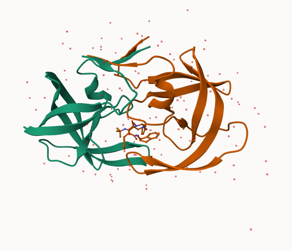
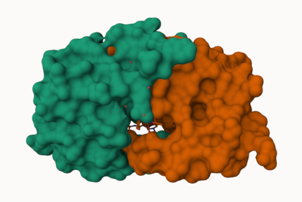
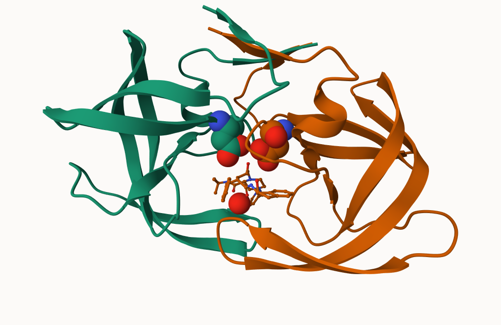

## Background

The main repository of of high-resolution structural data on biomolecules is called the **Protein Data Bank** (PDB). 

## PDB Statistics

What is in the PDB in terms of molecule type and structure determination method?

```{r}
library(readr)
pdb<- read_csv("Data Export Summary.csv")
head(pdb)
```

>Q1: What percentage of structures in the PDB are solved by X-Ray and Electron Microscopy.

93.87% of structures in the PDB are solved by X-Ray and Electron Microscopy. 

```{r}
x <- sum(pdb$`X-ray`) + sum(pdb$`EM`) 
y <- sum(pdb$Total)
x/y * 100
```

>Q2: What proportion of structures in the PDB are protein?

The total number of protein sequences in UniProt is 202556314. There are 217375 in the dataset. Leading to a ~0.1%. 

```{r}
pdb$Total[1]/202556314 * 100
```

>**Key-Point**: We have a very, very small structural coverage of known proteins (~0.1%). Most structues we know are about (~%80) come from one method (X-Ray Crystalography). 

>Q3: Type HIV in the PDB website search box on the home page and determine how many HIV-1 protease structures are in the current PDB?

After typing HIV into the search box in PDB, I saw that there were 4998 Structures that match the query. 

## Visualizing PDB Data with Mol-Star

Main stand alone web version with all features is at https://molstar.org/viewer/.







# GEtting started with the Bio3D package

Bio3D is on R package from CRAN for structural bioinformatics

>Q7

>Q8

>Q9

```{r}
library(bio3d)

pdb <- read.pdb("1hsg")
pdb
```

```{r}
pdb$atom
attributes(pdb)
```

There are lots of functions that can work with these `pdb` objects. 

```{r}
head( pdbseq(pdb))
```
We can have a quick interactive view of any of these `pdb` objects:

```{r}
#install.packages("pak")

#pak::pkg_install(c("bioboot/bio3dview",
                   #"NGLVieweR", 
                   #"bioc::msa")
                 #)
```

```{r}
library(bio3dview)

#view.pdb(pdb)
```

## Predict the flexiblity of a given structure

Let's do a Normal Mode Analysis (NMA) to predict the felxibility of a give `pdb` object:

```{r}
adk <- read.pdb("6s36")
```
```{r}
m <- nma(adk)
plot(m)
```
View the results with an interactive structure view

```{r}
#view.nma(m)
```

```{r}
mktrj(m, file="nma.pdb")
```


>Q. Create a custom view highlighting the active site ASP (`resno=25`), the two chains (in your choice of colors) and the ligand all on a custom color background. 

```{r}
#library(NGLVieweR)
#active.site <- atom.select(pdb, resno=25)

#view.pdb(pdb,
         #cols = c("red", "blue"),
         #highlight = active.site,
         #highlight.style = "spacefill",
         #backgroundColor = "pink") |>
  #setRock()


```

## Comparative analysis of the ADK family

Our first step is find a sequence for this family. We will use the database ID "1ake_A" here:

```{r}
id <- "1ake_A"

aa <- get.seq(id)
aa
```


Search for related sequences in the database

```{r}
#blast <- blast.pdb(aa)
```

```{r}
#head(blast$hit.tbl)
```


```{r}
#hits <- plot(blast) 
```

```{r}
#hits$pdb.id
```
```{r}
#f <- get.pdb(hits$pdb.id, path="pdbs", split = T, gzip = T)
```

```{r}
#pdbs <- pdbaln(f, fit= TRUE, exefile = "msa")
#pdbs
```

```{r}
#view.pdbs(pdbs)
```


PCA of all this structural data (x, y, and z atom coordinates):

```{r}
#pc <- pca(pdbs)
#plot(pc) 
```

```{r}
#plot(pc, 1:2)
```

Interactive view of the PC1 captured structural

```{r}
#view.pca(pc)
```

```{r}
#mktrj(pc, file="pca.pdb")
```


