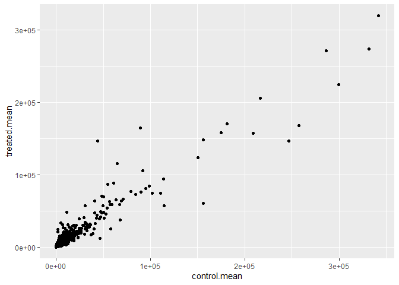
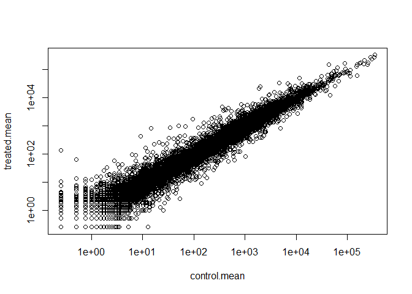
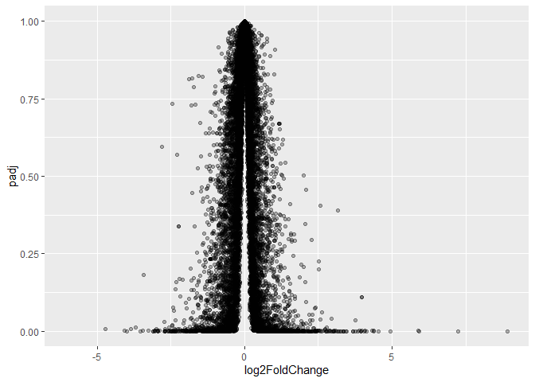
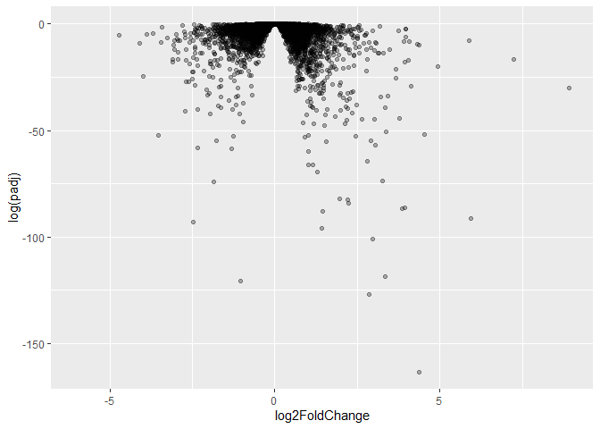
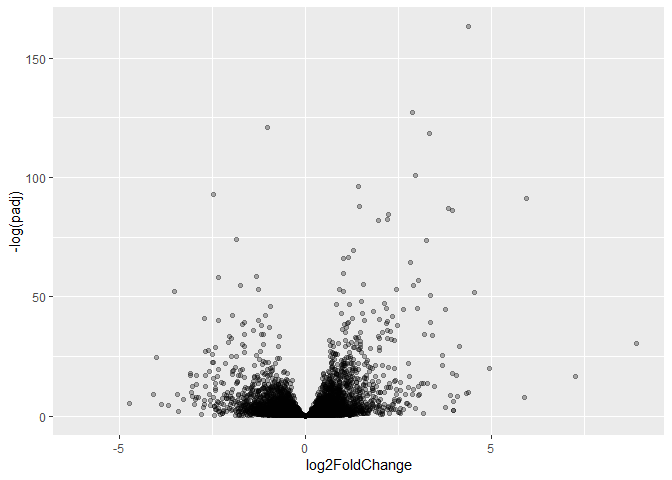
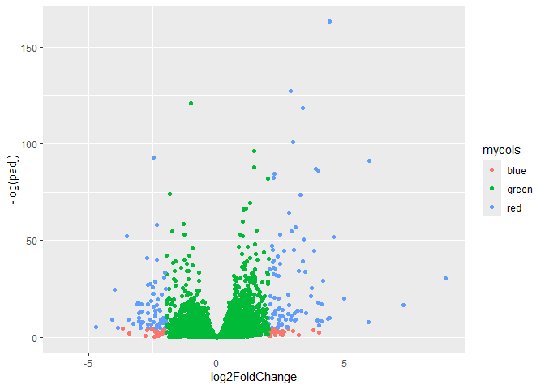

# Class 13:
Steven Studdard (PID: A19123470)

- [Background](#background)
- [Data Import](#data-import)
- [DESeq Analysis](#deseq-analysis)
- [Volcano Plot](#volcano-plot)
- [Save our results to date](#save-our-results-to-date)
- [Adding Annotation](#adding-annotation)
- [Pathway Analysis](#pathway-analysis)
- [Save our annotated results](#save-our-annotated-results)

``` r
library(BiocManager)
library(DESeq2)
library(ggplot2)
```

## Background

Today we’re going to do an RNA-seq analysis of a data set on the common
glucorticoid steroid dexamethasone (dex), and we’ll use DESq for this
analysis.

## Data Import

Let’s read the `count` data and `metadata` about this experiemnt setup
from the supplied CSV files:

``` r
counts <- read.csv("airway_scaledcounts.csv", row.names=1)
metadata <-  read.csv("airway_metadata.csv")
```

``` r
head(counts)
```

                    SRR1039508 SRR1039509 SRR1039512 SRR1039513 SRR1039516
    ENSG00000000003        723        486        904        445       1170
    ENSG00000000005          0          0          0          0          0
    ENSG00000000419        467        523        616        371        582
    ENSG00000000457        347        258        364        237        318
    ENSG00000000460         96         81         73         66        118
    ENSG00000000938          0          0          1          0          2
                    SRR1039517 SRR1039520 SRR1039521
    ENSG00000000003       1097        806        604
    ENSG00000000005          0          0          0
    ENSG00000000419        781        417        509
    ENSG00000000457        447        330        324
    ENSG00000000460         94        102         74
    ENSG00000000938          0          0          0

``` r
metadata
```

              id     dex celltype     geo_id
    1 SRR1039508 control   N61311 GSM1275862
    2 SRR1039509 treated   N61311 GSM1275863
    3 SRR1039512 control  N052611 GSM1275866
    4 SRR1039513 treated  N052611 GSM1275867
    5 SRR1039516 control  N080611 GSM1275870
    6 SRR1039517 treated  N080611 GSM1275871
    7 SRR1039520 control  N061011 GSM1275874
    8 SRR1039521 treated  N061011 GSM1275875

> Q1. How many genes are in this dataset?

There are 38694 genes in this dataset.

> Q2. How many ‘control’ cell lines do we have?

There are 4 control cell lines.

``` r
sum(metadata$dex == "control")
```

    [1] 4

``` r
ncol(counts)
```

    [1] 8

``` r
colnames(counts) == metadata$id
```

    [1] TRUE TRUE TRUE TRUE TRUE TRUE TRUE TRUE

- Find the “control” columns in our `counts` object.
- Extract just the “control” column values for all genes
- Calculate the average value per gene in these “control” columns

> Q3. How would you make the below code in either approach more robust?
> Is there a function that could help here?

For the code below, one improvement that i think would work would be to
just do `rowMeans()` on the control counts.

``` r
control.inds <- metadata$dex == "control"
control.counts <- counts[,control.inds]
control.mean <- rowMeans(control.counts)
```

Now do the same for the “treated” columns. Then make a plot of
`control.mean` vs treated.means

> Q4. Follow the same procedure for the treated samples (i.e. calculate
> the mean per gene across drug treated samples and assign to a labeled
> vector called treated.mean)

``` r
treated.inds <- metadata$dex == "treated"
treated.counts <- counts[,treated.inds]
treated.mean <- rowMeans(treated.counts)
```

> Q5 (a). Create a scatter plot showing the mean of the treated samples
> against the mean of the control samples. Your plot should look
> something like the following.

``` r
plot(control.mean, treated.mean)
```


> Q5 (b).You could also use the ggplot2 package to make this figure
> producing the plot below. What geom\_?() function would you use for
> this plot?

``` r
ggplot()+
  aes(control.mean, treated.mean)+
  geom_point()
```



For book-keeping let’s store these together as a new object called
`meancounts`.

``` r
meancounts <- data.frame(control.mean, treated.mean)
head(meancounts)
```

                    control.mean treated.mean
    ENSG00000000003       900.75       658.00
    ENSG00000000005         0.00         0.00
    ENSG00000000419       520.50       546.00
    ENSG00000000457       339.75       316.50
    ENSG00000000460        97.25        78.75
    ENSG00000000938         0.75         0.00

Our count data is highly skewed and when we see a pattern like this plot
it screams log transform.

> Q6. Try plotting both axes on a log scale. What is the argument to
> plot() that allows you to do this?

``` r
plot(meancounts, log="xy")
```

    Warning in xy.coords(x, y, xlabel, ylabel, log): 15032 x values <= 0 omitted
    from logarithmic plot

    Warning in xy.coords(x, y, xlabel, ylabel, log): 15281 y values <= 0 omitted
    from logarithmic plot



We most often use log2 transform for this kind of data in bioifomraticcs
because it makes my brain hurt less (interpretation much easier)

``` r
#Treated / Control
log2(20/20)
```

    [1] 0

``` r
log2(40/20)
```

    [1] 1

``` r
log2(10/20)
```

    [1] -1

``` r
log2(80/20)
```

    [1] 2

We call this little fraction the **“log2 fold change”** as it tells us
how much more or less gene expression we have in units of doubling, etc.

Let’s calculate the log2 fold cahnge for our `treated.mean` and
`control.mean` and call this `log2fc`.

``` r
meancounts$log2fc <- log2(meancounts[,"treated.mean"] / meancounts[, "control.mean"])
head(meancounts)
```

                    control.mean treated.mean      log2fc
    ENSG00000000003       900.75       658.00 -0.45303916
    ENSG00000000005         0.00         0.00         NaN
    ENSG00000000419       520.50       546.00  0.06900279
    ENSG00000000457       339.75       316.50 -0.10226805
    ENSG00000000460        97.25        78.75 -0.30441833
    ENSG00000000938         0.75         0.00        -Inf

A common “rule of thumb” threshold for calling a gene “up regulated” or
“down regulated” is a log2 fold-change value of +2 or -2 (or greater).

``` r
up.ind <- meancounts$log2fc > 2
down.ind <- meancounts$log2fc < -2
```

> Q8. Using the up.ind vector above can you determine how many up
> regulated genes we have at the greater than 2 fc level?

``` r
sum(up.ind, na.rm = TRUE)
```

    [1] 1846

> Q9. Using the down.ind vector above can you determine how many down
> regulated genes we have at the greater than 2 fc level?

``` r
sum(down.ind, na.rm = TRUE)
```

    [1] 2212

> Q10. Do you trust these results? Why or why not?

No, because it is missing p-values to differentiate from false positives
/ negatives.

## DESeq Analysis

Let’s do this analysis properly and not not forget about the signifcance
of the differences

For this we will use the **DESeq2** Package.

To run a DESeq analysis we need at least two inputs:

\-`countData` i.e. are gene counts across different experiments
-`colData` i.e. our metadata about those count columns

``` r
dds <- DESeqDataSetFromMatrix(countData = counts,
                              colData = metadata,
                              design = ~dex)
```

    converting counts to integer mode

Nowe we can run the DESeq analysis pipline using this `dds` object that
has all the inputs we need.

``` r
dds <- DESeq(dds)
```

    estimating size factors

    estimating dispersions

    gene-wise dispersion estimates

    mean-dispersion relationship

    final dispersion estimates

    fitting model and testing

``` r
res <- results(dds)
head(res)
```

    log2 fold change (MLE): dex treated vs control 
    Wald test p-value: dex treated vs control 
    DataFrame with 6 rows and 6 columns
                      baseMean log2FoldChange     lfcSE      stat    pvalue
                     <numeric>      <numeric> <numeric> <numeric> <numeric>
    ENSG00000000003 747.194195     -0.3507030  0.168246 -2.084470 0.0371175
    ENSG00000000005   0.000000             NA        NA        NA        NA
    ENSG00000000419 520.134160      0.2061078  0.101059  2.039475 0.0414026
    ENSG00000000457 322.664844      0.0245269  0.145145  0.168982 0.8658106
    ENSG00000000460  87.682625     -0.1471420  0.257007 -0.572521 0.5669691
    ENSG00000000938   0.319167     -1.7322890  3.493601 -0.495846 0.6200029
                         padj
                    <numeric>
    ENSG00000000003  0.163035
    ENSG00000000005        NA
    ENSG00000000419  0.176032
    ENSG00000000457  0.961694
    ENSG00000000460  0.815849
    ENSG00000000938        NA

## Volcano Plot

This is a ubiquitous and common visualization or this type od data that
puts the log2 foldchange and adjusted p-value together in one plot that
people can get insight for the whole dataset results.

``` r
ggplot(res)+
  aes(log2FoldChange, padj)+
  geom_point(alpha=0.3)
```

    Warning: Removed 23549 rows containing missing values or values outside the scale range
    (`geom_point()`).



That plot is not very useful because we don’t care about things with
high p-value, we want the very low values below our alpha threshold
(e.g. 0.01)

Let’s log the the y axis so we can see these genes/points more clearly.

``` r
ggplot(res)+
  aes(log2FoldChange, log(padj))+
  geom_point(alpha=0.3)
```

    Warning: Removed 23549 rows containing missing values or values outside the scale range
    (`geom_point()`).



We need to flip the y-axis so our “volcano” is not upside down.

``` r
ggplot(res)+
  aes(log2FoldChange, -log(padj))+
  geom_point(alpha=0.3)
```

    Warning: Removed 23549 rows containing missing values or values outside the scale range
    (`geom_point()`).



Let’s add some color

``` r
mycols <- rep("green", nrow(res))
mycols[ abs(res$log2FoldChange) > 2 ]  <- "blue" 

inds <- (res$padj < 0.01) & (abs(res$log2FoldChange) > 2 )
mycols[ inds ] <- "red"
```

``` r
ggplot(res)+
  aes(log2FoldChange, -log(padj), col=mycols)+
  geom_point()
```

    Warning: Removed 23549 rows containing missing values or values outside the scale range
    (`geom_point()`).



> Q. Add annotation to this volcano plot including the log2 fold-change
> thresholds of +2 and -2 and the p-value threshold of 0.05. Also color
> up the genes that meet both of these thresholds. These are the ones we
> will focus on next day!

## Save our results to date

``` r
write.csv(res, file="myresults.csv")
```

## Adding Annotation

``` r
library(AnnotationDbi)
library(org.Hs.eg.db)
```

``` r
columns(org.Hs.eg.db)
```

     [1] "ACCNUM"       "ALIAS"        "ENSEMBL"      "ENSEMBLPROT"  "ENSEMBLTRANS"
     [6] "ENTREZID"     "ENZYME"       "EVIDENCE"     "EVIDENCEALL"  "GENENAME"    
    [11] "GENETYPE"     "GO"           "GOALL"        "IPI"          "MAP"         
    [16] "OMIM"         "ONTOLOGY"     "ONTOLOGYALL"  "PATH"         "PFAM"        
    [21] "PMID"         "PROSITE"      "REFSEQ"       "SYMBOL"       "UCSCKG"      
    [26] "UNIPROT"     

> Q11. Run the mapIds() function two more times to add the Entrez ID and
> UniProt accession and GENENAME as new columns called
> res$entrez, res$uniprot and res\$genename.

We can now use the `mapIDs()` function to mapp between these different
database identifier formats.

``` r
res$symbol <- mapIds(org.Hs.eg.db,
                     keys=row.names(res),
                     keytype="ENSEMBL",
                     column="SYMBOL")
```

    'select()' returned 1:many mapping between keys and columns

> Q. Can you map to “GENENAME” and add as a new “column to our `res`
> object.

``` r
res$name <- mapIds(org.Hs.eg.db,
                     keys=row.names(res),
                     keytype="ENSEMBL",
                     column="GENENAME")
```

    'select()' returned 1:many mapping between keys and columns

> Q. Add “ENREZID” as `res$entrez`?

``` r
res$entrez <- mapIds(org.Hs.eg.db,
                     keys=row.names(res),
                     keytype="ENSEMBL",
                     column="ENTREZID")
```

    'select()' returned 1:many mapping between keys and columns

``` r
head(res)
```

    log2 fold change (MLE): dex treated vs control 
    Wald test p-value: dex treated vs control 
    DataFrame with 6 rows and 9 columns
                      baseMean log2FoldChange     lfcSE      stat    pvalue
                     <numeric>      <numeric> <numeric> <numeric> <numeric>
    ENSG00000000003 747.194195     -0.3507030  0.168246 -2.084470 0.0371175
    ENSG00000000005   0.000000             NA        NA        NA        NA
    ENSG00000000419 520.134160      0.2061078  0.101059  2.039475 0.0414026
    ENSG00000000457 322.664844      0.0245269  0.145145  0.168982 0.8658106
    ENSG00000000460  87.682625     -0.1471420  0.257007 -0.572521 0.5669691
    ENSG00000000938   0.319167     -1.7322890  3.493601 -0.495846 0.6200029
                         padj      symbol                   name      entrez
                    <numeric> <character>            <character> <character>
    ENSG00000000003  0.163035      TSPAN6          tetraspanin 6        7105
    ENSG00000000005        NA        TNMD            tenomodulin       64102
    ENSG00000000419  0.176032        DPM1 dolichyl-phosphate m..        8813
    ENSG00000000457  0.961694       SCYL3 SCY1 like pseudokina..       57147
    ENSG00000000460  0.815849       FIRRM FIGNL1 interacting r..       55732
    ENSG00000000938        NA         FGR FGR proto-oncogene, ..        2268

## Pathway Analysis

Now we have our annotated results with their log2 fold-change and
p-values we can figure out which biological pathways and process these
genes are involved with.

We will use the **gage** and **pathview** packages for this step and we
can install them with
`BiocManager::install( c("pathview", "gage", "gageData"))`

``` r
library(gage)
library(gageData)
library(pathview)
```

``` r
data(kegg.sets.hs)
head(kegg.sets.hs, 2)
```

    $`hsa00232 Caffeine metabolism`
    [1] "10"   "1544" "1548" "1549" "1553" "7498" "9"   

    $`hsa00983 Drug metabolism - other enzymes`
     [1] "10"     "1066"   "10720"  "10941"  "151531" "1548"   "1549"   "1551"  
     [9] "1553"   "1576"   "1577"   "1806"   "1807"   "1890"   "221223" "2990"  
    [17] "3251"   "3614"   "3615"   "3704"   "51733"  "54490"  "54575"  "54576" 
    [25] "54577"  "54578"  "54579"  "54600"  "54657"  "54658"  "54659"  "54963" 
    [33] "574537" "64816"  "7083"   "7084"   "7172"   "7363"   "7364"   "7365"  
    [41] "7366"   "7367"   "7371"   "7372"   "7378"   "7498"   "79799"  "83549" 
    [49] "8824"   "8833"   "9"      "978"   

We need a named vector of importance (e.g. fold-change values) that has
gerene ids as names. These names need to be in the correct format (using
the correct database format for the IDs)

We will make a input vector called `foldchanges` that has “entrez” ids
as names.

``` r
foldchanges <- res$log2FoldChange
names(foldchanges) <- res$entrez
```

``` r
keggres = gage(foldchanges, gsets = kegg.sets.hs)
```

``` r
attributes(keggres)
```

    $names
    [1] "greater" "less"    "stats"  

The Top 3 overlapping pathways

``` r
head(keggres$less, 3)
```

                                          p.geomean stat.mean        p.val
    hsa05332 Graft-versus-host disease 0.0004250461 -3.473346 0.0004250461
    hsa04940 Type I diabetes mellitus  0.0017820293 -3.002352 0.0017820293
    hsa05310 Asthma                    0.0020045888 -3.009050 0.0020045888
                                            q.val set.size         exp1
    hsa05332 Graft-versus-host disease 0.09053483       40 0.0004250461
    hsa04940 Type I diabetes mellitus  0.14232581       42 0.0017820293
    hsa05310 Asthma                    0.14232581       29 0.0020045888

Now we can use the **pathview** package with the found KEGG pathway IDs
(e.g. “hsa05310” for the Asthma pathway) to make a pathway figure
showing out differential expressed genes (DEGs)

``` r
pathview(gene.data=foldchanges, pathway.id="hsa05310")
```

    'select()' returned 1:1 mapping between keys and columns

    Info: Working in directory C:/Users/Administrator/Desktop/BIMM143/bimm143_github/class13

    Info: Writing image file hsa05310.pathview.png


> Q12. Can you do the same procedure as above to plot the pathview
> figures for the top 2 down-reguled pathways?

``` r
pathview(gene.data=foldchanges, pathway.id="hsa05332")
```

    'select()' returned 1:1 mapping between keys and columns

    Info: Working in directory C:/Users/Administrator/Desktop/BIMM143/bimm143_github/class13

    Info: Writing image file hsa05332.pathview.png


``` r
pathview(gene.data=foldchanges, pathway.id="hsa04940")
```

    'select()' returned 1:1 mapping between keys and columns

    Info: Working in directory C:/Users/Administrator/Desktop/BIMM143/bimm143_github/class13

    Info: Writing image file hsa04940.pathview.png


## Save our annotated results

``` r
write.csv(res, file="myresults_annotated.csv")
```
